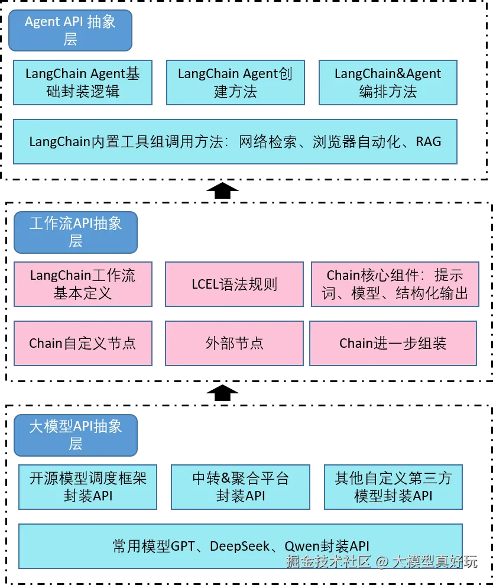

# LangChain

LangChain 是一个开源框架，旨在简化基于大型语言模型（LLM）的应用程序开发。该框架由 Harrison Chase 于 2022 年 10 月发起，迅速成为 GitHub 上增长最快的开源项目之一，直到现在仍然以飞快速度不断迭代升级。它支持 Python和JavaScript，适用于构建各种大模型驱动的应用程序，如聊天机器人、智能搜索、问答工具、摘要工具以及能够执行机器人流程自动化（RPA）的 AI 代理。

直观来说，LangChain可以将工具组件、提示词组件、大模型组件有机融合，封装成可自动执行每一步的组件，同样该组件也可作为别的编排流程中的组件。用LangChain开发智能体一个形象的比喻是就像在搭乐高积木，通过组合构建出适用于不同场景需求的大模型应用。

除此之外，市面上目前还有谷歌ADK， OpenAI的Agent SDK等，这么多框架为什么说只有LangChain是大模型时代必须掌握的Agent开发方式呢? 原因如下：

- 谷歌ADK、OpenAI Agent SDK和Qwen-Agent这些大家可以看作一派方法，它们背后的设计理念是高度类似的。它们的出发点是希望借助大模型的原始能力，通过两三行代码就可以构建好一个Agent。这也是我那两篇Qwen-Agent教程大家读起来非常简单的原因。这些项目更适用于快速AI Agent开发交互应用等科研性质的项目。
- LangChain自成一派。LangChain作为现有最强的大语言模型能力增强器，本身考虑了大语言模型运行的所有情况，包含了丰富的细分功能。因此在很多场景下LangChain工具本身不可代替（控制更加细粒度）。

综上所述，哪怕当前OpenAI、Google和阿里等巨头纷纷下场发布全新一代Agent开发框架，LangChain的地位依然屹立不倒。而像AutoGen、CrewAI和Dify等在LangChain面前更像是快速落地的玩具框架，很难完全达到LangChain同级别的工业水准。



LangChain中一个基础的链一般由如下三部分构成，分别是提示词模板、大模型和结构化解析器。

## LCEL

LCEL，全称为LangChain Expression Language，是一种专为 LangChain 框架设计的表达语言。它通过一种链式组合的方式，允许开发者使用清晰、声明式的语法来构建语言模型驱动的应用流程。

简单来说，LCEL 是一种“函数式管道风格”的组件组合机制，用于连接各种可执行单元（Runnable）。这些单元包括提示模板、语言模型、输出解析器、工具函数等。

### LCEL的设计目的
LCEL 的设计初衷在于：

- 模块化构建：将模型调用流程拆解为独立、可重用的组件。
- 逻辑可视化：通过语法符号（如管道符 |）呈现出明确的数据流路径。
- 统一运行接口：所有 LCEL 组件都实现了 .invoke()、.stream()、.batch() 等标准方法，便于在同步、异步或批处理环境下调用。
- 脱离框架限制：相比传统的 Chain 类和 Agent 架构，LCEL 更轻量、更具表达力，减少依赖的“黑盒”逻辑。

### LCEL的核心组成
LCEL的核心组成有如下三点:

1. Runnable 接口
LCEL 的一切基础单元都是 Runnable 对象，它是一种统一的可调用接口，支持如下形式：

- .invoke(input)：同步调用
- .stream(input)：流式生成
- .batch(inputs)：批量执行


2. 管道运算符 |

这是 LCEL 最具特色的语法符号。多个 Runnable 对象(也就是我们说的组件)可以通过 | 串联起来，形成清晰的数据处理链。例如：

```python
prompt | model | parser
```
表示数据将依次传入提示模板、模型和输出解析器，最终输出结构化结果。

3. PromptTemplate 与 OutputParser

LCEL 强调组件之间的职责明确，Prompt 只负责模板化输入，Parser 只负责格式化输出，Model 只负责推理。

## 来源

- [深入浅出LangChain AI Agent智能体开发教程](https://juejin.cn/post/7526993716071202851)

