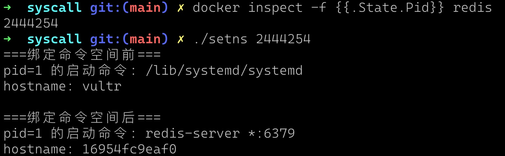

# 系统编程

## 文件操作相关

### open

```c
#include <sys/types.h>
#include <sys/stat.h>
#include <fcntl.h>

int open(const char *pathname, int flags);
int open(const char *pathname, int flags, mode_t mode);
```
`open`系统调用的系统调用号是`2`，其`flags`参数常见标志值如下：

标志 | 用途 | 分组 | 注意
--- | --- | --- | ---
O_RDONLY | 以只读方式打开 | 文件访问模式标志
O_WRONLY  | 以只写方式打开 | 
O_RDWR | 以读写方式打开 | 
O_CLOEXEC | 设置close-on-exec标志 | 文件创建标志  | 自Linux 2.6.23版本开始
O_CREAT | 若文件不存在则创建之 |
O_TMPFILE | 用于创建匿名临时文件，当关闭文件描述符时，文件就会自动被删除
O_DIRECTORY | 如果pathname不是目录，则失败
O_EXCL | 结合O_CREAT参数使用，专门用于创建文件，会检查文件是否存在，不存在则新建，否则返回错误信息 |  | **检查文件存在与否和创建文件这两步属于同一原子操作**。可用于任务单进程执行处理
O_TRUNC | 截断已有文件，并将其长度置为零 | 
O_DIRECT | 无缓冲的输入/输出 | 
O_NOFOLLOW | 对符号链接不予解引用 | 
O_NOATIME | 调用read()时，不修改文件最近访问时间 |  | 自 Linux2.6.8版本开始
O_LARGEFILE | 在32位系统中使用此标志打开大文件 | 
O_APPEND  | 总在文件尾部追加数据 | 文件状态控制标志
O_ASYNC | 当I/O操作可行时，产生信号（signal）通知进程。用于信号驱动IO，IO操作会立即返回，同时会在IO操作完成时候发出相应的信号 | | 对正常文件的描述符无效，仅对特定类型的文件有效，诸如终端、FIFOS及socket
O_DSYNC | 提供同步的I/O数据完整性。每一次write操作结束前，都会将文件内容写入硬件（比如磁盘中）|  | 自Linux 2.6.33版本开始
O_NONBLOCK | 以非阻塞方式打开 |
O_SYNC | 以同步方式写入文件。 每一次write操作结束前，都会将文件内容和元信息写入硬件（比如磁盘中） | 

`flags`分组含义：
- **文件访问模式标志：** 用于控制文件访问模式，Open打开文件时候必须使用且只能使用只读、只写、读写中的一个
- **文件创建标志：** 文件创建标志控制的是open和openat在打开文件时的行为
- **文件状态标志：** 文件状态标志控制的是打开文件后的后续IO操作

`open`系统调用的第三个参数`mode`，只有在使用 `O_CREAT` 或 `O_TMPFILE` 标志时才有效，它用来指定新文件的访问权限。`creat`系统调用底层用的`open`:

```go
func Creat(path string, mode uint32) (fd int, err error) {
	return Open(path, O_CREAT|O_WRONLY|O_TRUNC, mode)
}
```

`O_CLOEXEC`需要特别介绍一下。当一个Linux进程使用fork创建子进程后，父进程原有的文件描述符也会复制给子进程。而常见的模式是在fork之后使用exec函数族替换当前进程空间。此时，由于替换前的所有变量都不会被继承，所以文件描述符将丢失，而丢失之后就无法关闭相应的文件描述符，造成泄露。

```c
#include <fcntl.h>
#include <unistd.h>

int main() {
    int fd = open("./text.txt", O_RDONLY);
    if (fork() == 0) {
        // child process
        char *const argv[] = {"./child", NULL};
        execve("./child", argv, NULL); // fd left opened
    } else {
        // parent process
        sleep(30);
    }

    return 0;
}
```
上面代码中./child会在启动30秒后会自动退出。在启动这个程序之后，我们使用ps -aux | grep child找到child对应的进程ID，然后使用:

```shell
readlink /proc/xxx/fd/yyy
```
查看，其中xxx为进程ID，yyy是fd中的任意一个文件。我们调查fd中的所有文件，一定能发现一个文件描述符对应text.txt。也就是说，在执行execve之后，子进程始终保持着text.txt的描述符，且没有任何方法关闭它。

解决这个问题的方法一般有两种：

1. 在fork之后，execve之前使用close关闭所有文件描述符。但是如果该进程在此之前创建了许多文件描述符，在这里就很容易漏掉，也不易于维护。
2. 在使用open创建文件描述符时，加入O_CLOEXEC标志位：
    ```c
    int fd = open("./text.txt", O_RDONLY | O_CLOEXEC);
    ```
    通过这种方法，在子进程使用execve时，文件描述符会自动关闭。

### creat

```c
#include <sys/types.h>
#include <sys/stat.h>
#include <fcntl.h>

int creat(const char *pathname, mode_t mode);
```

`creat`系统调用等价于如下`open`调用：
```c
fd = open(pathname, O_WRONLY | O_CREAT | O_TRUNC, mode);
```

`creat`用来创建文件的系统调用。创建文件的系统调用为啥是creat而不是create？现代Linux系统调用名称大部分是继承自Unix系统。根据《Unix传奇》一书介绍：

> 顺便说一下，creat 系统调用之所以这么拼写，只能归咎于肯 · 汤普森的个人品位，没有其他什么好借口。罗布·派克曾经问肯，如果重写 Unix，他会做哪些修改。他的答案是什么？“我会在 creat 后头加上字母 e。”

顺便提一下，肯 · 汤普森除了发明Unix系统外，他还是Utf-8编码以及Go语言的发明者。

### read

```c
#include <unistd.h>

ssize_t read(int fd, void *buf, size_t count);
```
`read`系统调用用来读取fd文件描述符指向的文件，其系统调用号是0。`read`系统调用的count参数指定最多能读取的字节数。buffer参数提供用来存放输入数据的内存缓冲区地址。缓冲区至少应有count个字节。

如果`read`调用成功，将返回实际读取的字节数，如果遇到文件结束（EOF）则返回0，如果出现错误则返回-1。**一次`read`系统调用读取的字节数可能会小于指定的count数**，读取完成之后，`read`会更新文件偏移，读取多少字节数，就向后移动多少字节。

对于以非阻塞形式打开的文件，还可能返回EAGAIN或EWOULDBLOCK，此时需要`read`调用者不断尝试读取。

使用C语言读取文件时候，应该注意需要将读取的字节数对应地址的缓冲置为空字符`\0`，用来表示读取到的字符串的终止:

```c
#define MAX_READ 20
char buffer[MAX_READ+1]; // 由于空字符占用一个字节的内存，
// 所以缓冲区大小至少要比预计读取的最大字符串多出1个字节
ssize_t numRead;

numRead = read(STDIN_FILENO, buffer, MAX_READ);
if (numRead == -1) {
    perror("read error");
    return;
}

buffer[numRead] = '\0'; // 空字符串
printf("Thead input data was: %s\n", buffer);
```

### write

```c
#include <unistd.h>

ssize_t write(int fd, const void *buf, size_t count);
```

`write`的系统调用号是1。如果`write`调用成功，将返回实际写入文件的字节数，**该返回值可能小于count参数值。这被称为“部分写”(partial write)**。对磁盘文件来说，造成“部分写”的原因可能是由于磁盘已满，或是因为进程资源对文件大小的限制（RLIMIT_FSIZE限制）。

对磁盘文件执行I/O操作时，`write`调用成功并不能保证数据已经写入磁盘。因为为了减少磁盘活动量和加快`write`系统调用，内核会缓存磁盘的I/O操作，这叫**buffer I/O**。为了避免这种情况，可以使用`sync` 或 `fsync` 系统调用，强制进行落盘操作，或者在`open`创建文件时使用O_SYNC或O_DSYNC标志位来解决这一问题。

同`read`类似，`write`在成功写入n个字节后，会将文件偏移更新n个字节。一般来说，`write`开始写入时的文件偏移就是当前的文件偏移（比如通过`read`读取数据时候更改了偏移或者`lseek`显示的更改了偏移），但是，**当文件描述符是通过open系统调用创建，且创建时使用了O_APPEND标志位的话，每次write开始写入前，都会默认将文件偏移移到文件末尾**。

虽然不能保证数据一定写入硬盘，POSIX标准同样规定了一件事：即使不保证写入硬盘，`read`读入的数据一定是`write`成功之后的数据。

```
After a write() to a regular file has successfully returned:

    Any successful read() from each byte position in the file that was modified by that write shall return the data specified by the write() for that position until such byte positions are again modified.
```

### close

```c
#include <unistd.h>

int close(int fd);
```
`close` 系统调用用来关闭一个打开的文件描述符，并将其释放回调用进程，供该进程继续使用。文件描述符属于有限资源，对于长期运行并处理大量文件的程序，如果一直不关闭文件描述符，可能会导致一个进程将文件描述符资源消耗殆尽。

### lseek

```c
#include <sys/types.h>
#include <unistd.h>

off_t lseek(int fd, off_t offset, int whence);
```

whence参数表明参照那个基点来解释offset参数。

whence参数 | 含义
--- | ---
SEEK_SET | 将文件偏移量设置为从文件头部起始点开始的offset个字节
SEEK_CUR | 相对于当前文件偏移量，将文件偏移量调整offset个字节。简而言之，相对于文件头部的绝对偏移量=当前文件偏移量+offset
SEEK_END | 将文件偏移量设置为起始于文件尾部的offset个字节。也就是说，offset参数应该从文件最后一个字节之后的下一个字节算起

#### 文件空洞

如果程序的文件偏移量已然跨越了文件结尾，然后再执行I/O操作，将会发生什么情况？read调用将返回0，表示文件结尾。而write函数可以在文件结尾后的任意位置写入数据。

从文件结尾后到新写入数据间的这段空间被称为文件空洞。从编程角度看，文件空洞中是存在字节的，读取空洞将返回以0（空字节）填充的缓冲区。

然而，文件空洞不占用任何磁盘空间。直到后续某个时点，在文件空洞中写入了数据，文件系统才会为之分配磁盘块。文件空洞的主要优势在于，与为实际需要的空字节分配磁盘块相比，稀疏填充的文件会占用较少的磁盘空间。

空洞的存在意味着一个文件名义上的大小可能要比其占用的磁盘存储总量要大（有时会大出许多）。向文件空洞中写入字节，内核需要为其分配存储单元，即使文件大小不变，系统的可用磁盘空间也将减少。

> 在大多数文件系统中，文件空间的分配是以块为单位的（14.3节）。块的大小取决于文件系统，通常是1024字节、2048字节、4096字节。如果空洞的边界落在块内，而非恰好落在块边界上，则会分配一个完整的块来存储数据，块中与空洞相关的部分则以空字节填充。

### pread

```c
#include <unistd.h>

ssize_t pread(int fd, void *buf, size_t count, off_t offset);
```

`pread`系统调用同`read`调用类似，但`pread`是在文件的offset处读取，而不是在文件当前的偏移量进行读取。另外`pread`不会更改文件的offset, 所以它非常适合多线程程序并发地对同一个fd指向的文件进行读取。

pread系统调用相当于下面的一些操作的原子操作：

```c
off_t orig;
orig = lseek(fd, 0, SEEK_CUR);
lseek(fd, offset, SEEK_SET);
s = read(fd, buf, len);
lseek(fd, origin, SEEK_SET);
```


### pwrite

```c
#include <unistd.h>

ssize_t pwrite(int fd, const void *buf, size_t count, off_t offset);
```

说明见`pread`。

### readv

```c
#include <sys/uio.h>

ssize_t readv(int fd, const struct iovec *iov, int iovcnt);

struct iovec {
    void  *iov_base;    /* Starting address */
    size_t iov_len;     /* Number of bytes to transfer */
};
```


`readv`系统调用与后面的`writev`等系统调用属于**Scatter-Gather I/O**，简称**SG I/O**。

`readv`相当于多个`read`操作的原子操作。比如对于T-L-V编码的文件，我们可以一次性读取T和L段内容到两块不连续内存中。`readv`保证了原子性，并且读取内容是按照顺序处理的，只有iov[0]指向的内存填满之后，才会去填充iov[1]。

同`read`系统调用类似，`readv`返回的读取的字节数，同样可能会小于iovec->iov_len之和。

### writev

```c
#include <sys/uio.h>

ssize_t writev(int fd, const struct iovec *iov, int iovcnt);
```

说明见`readv`。

### preadv/pwritev

说明见`pread` 和 `readv`。

## I/O 技术比较

I/O 类型 | API | 优点 | 缺点
--- | --- | --- | ---
阻塞型(通用I/O、SG-I/O) | [p]read[v]/[p]write[v] | 易于使用 | 慢。缓冲区双重拷贝
内存映射 | mmap |
DIO(非阻塞，绝大多数是同步方式) | 使用O_DIRECT标志的open调用 |
AIO(非阻塞，异步) | io_* |

### eventfd

```c
#include <sys/eventfd.h>

int eventfd(unsigned int initval, int flags);
```

`eventfd`系统调用会创建用于事件通知的`eventfd`对象，返回的整数值就是该对象的文件描述符。`eventfd`对象拥有一个由内核的维护的8字节的无符号整数，称为`counter`，其通知机制就是建立在`counter`的数值变化之上。对于`eventfd`对象的文件描述符，我们既可以进行read/write操作，也可以使用`epoll`等多路复用机制来监听，以实现事件信号的通知。

`eventfd`系统调用的参数说明：

- intval：eventfd对象的counter的初始化值
- flags: 设置eventfd对象的文件描述符fd属性。值有：
    - EFD_CLOEXEC：设置为close-on-exec，类似通用文件的O_CLOEXEC标志，调用exec时候会自动关闭fd
    - EFD_NONBLOCK：设置为非阻塞
    - EFD_SEMAPHORE：从eventfd读出类似信号量的数据

#### read/write/close 操作

`eventfd`对象的文件描述符支持`read`、`write`、`close`操作。

当进行`read`读取时候，提供的buf最少需要8个字节，如果小于8个字节，会返回EINVAL错误。根据`eventfd`的counter值和flags参数，`read`会有不同的返回结果：
- 当counter的值是0时候，如果flags参数设置了`EFD_NONBLOCK`，那么`read`会返回
EAGAIN错误，否则会进入阻塞状态
- 当counter的值大于0，如果此时flags参数设置了EFD_SEMAPHORE，那么read返回的buf值是1，并且会将counter的值减一，否则`read`返回的buf值是counter值，此时counter会被重置为0

`eventfd`的counter最大值是`uint64最大值-1`，即`0xfffffffffffffffe`。 当进行`write`写入时候，如果`write`调用提供的buf小于8个字节，或者尝试写入0xffffffffffffffff，`write`会返回EINVAL错误。每次`write`调用时候，内核都会将buf的值加到eventfd的counter上，如果最终值超过了counter的最大值，此时如果flags设置了`EFD_NONBLOCK`那么会返回EAGAIN错误，否则会进入阻塞状态（此后如果有read操作，write会写入成功）。

当不再需要eventfd的文件描述符时，应将其关闭，当文件描述符关闭之后，该文件描述符关联的eventfd对象也会被释放掉。另外除非设置了 close-on-exec 标志，否则eventfd创建的文件描述符将在`execve`中保留。

#### select/poll/epoll操作

eventfd一个重要用法，是将其文件描述符用于`epoll`等多路复用系统调用中。相比使用管道发送事件信号，eventfd的内核开销更低，并且它只需要一个文件描述符。在进程的`/proc/[pid]/fdinfo`目录中，我们可以查看eventfd的counter的值。

- 当counter值大于0时候，eventfd是可读的
- 当counter小于0xffffffffffffffff，eventfd是可写的，因为至少可以写入一个1而不阻塞

## Namespace

### setns

```c
#define _GNU_SOURCE
#include <sched.h>

int setns(int fd, int nstype);
```

`setns`用于将当前进程加入到已有的 namespace 中，其中：

- fd: 是要加入 namespace 的文件描述符。它指向 /proc/[pid]/ns 目录下的某个文件的文件描述符
- nstype： 用于检查fd指向的namespace是否符合要求，0表示不做任何检查。

绑定PID命名空间示例：

```c
snprintf(filename, sizeof(filename), "/proc/%d/ns/pid", pid);
nstype = CLONE_NEWPID;

fd = open(filename, O_RDONLY);
if (fd < 0)
  die("open()");

int rv;
rv = setns(fd, nstype);
close(fd);
if (rv != 0) {
  die("setns()");
}
```

绑定到容器的命名空间进行测试：

```shell
docker run -d --name redis -p 6379:6379 redis:latest # 创建redis容器
docker inspect -f {{.State.Pid}} redis # 获取容器的redis进程id
make setns # 构建测试程序
./setns 2444254 # 2444254是容器的redis的进程id
```

测试的结果：



## 零拷贝

### mmap

```c
#include <sys/mman.h>

void *mmap(void *addr, size_t length, int prot, int flags,
            int fd, off_t offset);
```

`mmap`系统调用用来在调用进程的虚拟地址空间中创建一个新的内存映射。

`addr`参数指定映射放置的虚拟地址，若为`NULL`，则由内核选择一个合适地址。不能与既有的映射冲突，那么`addr`必须是分页对齐的。

`length`参数指定映射区域的长度，由于内核是以分页大小为单位(`sysconf(_SC_PAGESIZE)`)来创建映射的，实际`length`会调整为分页大小的下一个倍数(向上舍入)。

`prot`参数指定映射的保护方式，该值是一个位掩码，取值有：

值 | 说明
--- | ---
PROT_NONE | 不可访问
PROT_READ | 可读
PROT_WRITE | 可写
PROT_EXEC | 可执行

`PROT_NONE` 一个用途是实现保护页(Guard Pages),用来防止缓冲区溢出攻击，可以在进程分配的内存区域的起始位置或者结束位置设置守护分页，如果越界访问了内核会生成一个 `SIGSEGV` 信号，并异常终止。不同的进程可以使用不同的保护位来映射同一个内存区域，我们可以使用 `mprotect` 系统调用来修改内存保护位。

`flags` 参数控制映射特性：

标志 | 是否必须包含 |  说明
--- | --- | ---
MAP_PRIVATE | Y | 创建一个私有映射
MAP_SHARED | Y | 创建一个共享映射
MAP_ANONYMOUS | N | 创建一个匿名映射
MAP_FIXED | N | 映射到指定的地址
MAP_NORESERVE | 控制交换空间的预留

`fd`参数用于指定被映射的文件的文件描述符。`offset`参数指定映射在文件中的起点，它必须是系统分页大小的倍数。

下面是使用`mmap`实现的一个建议版本`cat`示例:

```c
fd = open(argv[1], O_RDONLY);
if (fd == -1) errExit("open");

if (fstat(fd, &sb) == -1) errExit("fstat");

addr = mmap(NULL, sb.st_size, PROT_READ, MAP_PRIVATE, fd, 0);
if (addr == MAP_FAILED) errExit("mmap");

if (write(1, addr, sb.st_size) != sb.st_size) fatal("partial/failed write");
```

#### 边界问题

由于映射的实际大小需要是分页大小的整数倍，另外可以指定的映射大小可以小于文件的大小，那么存在两种边界问题：

- 映射文件大小超过映射范围：
- 映射文件未超过映射范围：

假定分页大小为4096字节，对于第一种情况：


对于第二种情况：


### munmap

```c
#include <sys/mman.h>

int munmap(void *addr, size_t length);
```
`munmap`系统调用用于删除一个映射。`addr`参数指定待删除映射的起始地址，它必须与一个分页边界对齐。 `length`参数指定待删除映射区域的大小。

若要删除整个映射，可以将`addr`指定为上一个`mmap`调用返回的地址，并且`length`值与`mmap`调用使用的`length`的值一样：

```c
addr = mmap(NULL, length, PROT_READ | PROT_WRITE, MAP_PRIVATE, fd, 0);
if (addr == MAP_FAILED)
    errExit("mmap");
/* do somethings */

if (munmap(addr, length) == -1)
    errExit("munmap");
```

如果在由`addr`和`length`指定的地址范围中不存在映射，那么`munmap()`将不起任何作用并返回0（表示成功）。

在解除映射期间，内核会删除进程持有的在指定地址范围内的所有内存锁。（内存锁是通过`mlock()`或`mlockall()`来创建的）。

当一个进程终止或执行了一个 `exec()` 之后进程中所有的映射会自动被解除。为确保一个共享文件映射的内容会被写入到底层文件中，在使用 `munmap()` 解除一个映射之前需要调用`msync()`。

### 文件映射

要创建一个文件映射需要执行下面的步骤：
- 1．获取文件的一个描述符，通常通过调用`open()`来完成。
- 2．将文件描述符作为fd参数传入`mmap()`调用。

执行上述步骤之后`mmap()`会将打开的文件的内容映射到调用进程的地址空间中。一旦`mmap()`被调用之后就能够关闭文件描述符了，而不会对映射产生任何影响。


#### 私有文件映射

私有文件映射用途：
- 允许多个进程共享同一个程序或者共享库的代码段。
- 映射可执行文件或者共享库的初始化数据段，即使修改了数据段内容，也不会更改底层文件上。

这两种用法一般是由程序加载器和动态链接器创建的，我们可以在`/proc/PID/maps`输出中看到这两种映射。

对于第一种用途为啥不直接设置映射保护为`PROT_READ|PROT_EXEC`来实现？这是因为应用程序可以通过`mprotect`修改映射保护设置，这样就会导致可以更改底层文件了。

#### 共享文件映射

当多个进程创建了同一个文件区域的共享映射时，它们会共享同样的内存物理分页。此外，对映射内容的变更将会反应到文件上。共享文件映射存在两个用途：内存映射I/O和IPC。


##### 内存映射I/O

内存映射I/O指的是通过访问内存中的字节来执行文件I/O，而依靠内核来确保对内存的变更会被传递到映射文件中。

内存映射I/O的优势有：

- 减少IO传输次数，以及上下文切换次数
- 节省内存使用，从一个应用空间缓冲区和内核空间缓冲区，变成了一个共享的缓冲区。


从上面传统I/O流程中，可以看到一次`read`或`write`调用，需要两次数据拷贝，两次上下文切换，其中一次拷贝是`DMA`操作, 故完整一次I/O流程需要**两次CPU拷贝，两次DMA拷贝，四次上下文切换** 。

如果使用`mmap`后，只需要**一次CPU拷贝（从文件拷贝到用户空间与内核空间的共享缓冲区中），两次DMA拷贝，四次上下文切换**，相同传统I/O操作少了一次CPU拷贝。这种技术也称为**零拷贝（Zero-Copy）技术**。零拷贝是一种高效的数据传输技术，旨在减少或消除数据在传输过程中的拷贝次数，从而提高数据传输效率和系统性能。

一个用户程序通过`mmap`从磁盘读取数据并通过网络发送出去的过程如下:


**注意**：

- 一次传统I/O过程中，数据通常需要从硬盘（或其他存储设备）读取到内核缓冲区，然后再复制到用户缓冲区，最后根据需要将数据发送到网络或其他外部设备。
- **DMA（Direct Memory Access，直接内存存取）** 指的是控制器将数据从硬盘（或其他存储设备）拷贝到内核缓冲区。这个过程是由DMA控制器完成的，不需要CPU的参与，从而减轻了CPU的负担。
- 零拷贝并非指完全没有数据拷贝的过程。

**内存映射I/O所带来的性能优势在在大型文件中执行重复随机访问时最有可能体现出来**。

如果顺序地访问一个文件，并假设执行I/O时使用的缓冲区大小足够大以至于能够避免执行大量的I/O系统调用，那么与`read()`和`write()`相比，`mmap()`带来的性能上的提升就非常有限或者说根本就没有带来性能上的提升。对于小数据量I/O来讲，内存映射I/O的开销（即映射、分页故障、解除映射以及更新硬件内存管理单元的超前转换缓冲器）实际上要比简单的`read()`或`write()`大。简而言之，**小文件的I/O操作并不适合使用内存映射I/O处理**。

##### 基于共享文件映射的IPC

### msync

```c
#include <sys/mman.h>

int msync(void *addr, size_t length, int flags);
```

内核会自动将发生在`MAP_SHARED`映射内容上的变更写入到底层文件中，但在默认情况下，内核不保证这种同步操作会在何时发生。`msync()`系统调用让应用程序能够显式地控制何时完成共享映射与映射文件之间的同步。

`addr`参数地址必须是分页对齐的，`length`会被调整为向上舍入到系统分页大小的下一个整数倍。

`flags`参数取值有：
- MS_SYNC 

    执行同步操作，会阻塞直到内存区域所有修改过的分页被落盘操作完成。
- MS_ASYNC

    执行一个异步的文件写入操作，内存区域只是与内核高速缓冲区进行同步，最终由`pdflush`内核线程刷入到磁盘中。
- MS_INVALIDATE

    使映射数据的缓冲副本失效。当内存区域中所有被修改过的分页被同步到文件中之后，内存区域中所有与底层文件不一致的分页会被标记为无效。当下次引用这些分页时会从文件的相应位置处复制相应的分页内容，其结果是其他进程对文件做出的所有更新将会在内存区域中可见。

### 匿名映射

匿名映射是没有对应文件的一种映射。

在Linux上，使用`mmap()`创建匿名映射存在两种不同但等价的方法：
- 在`flags`中指定`MAP_ANONYMOUS`并将`fd`指定为−1。
- 打开`/dev/zero`设备文件并将得到的文件描述符传递给`mmap()`。

不管是使用`MAP_ANONYMOUS`还是使用`/dev/zero`技术，得到的映射中的字节会被初始化为0。在两种技术中，`offset`参数都会被忽略（因为没有底层文件，所以也无从指定偏移量）。

#### 私有匿名映射

`MAP_PRIVATE`匿名映射用来分配进程私有的内存块并将其中的内容初始化为0。

```c
fd = open("/dev/zero", O_RDWR);
if (fd == -1)
    errExit("open");
addr = mmap(NULL, length, PROT_READ | PROT_PRIVATE, fd, 0);

if (addr == MAP_FAILED)
    errExit("mmap");
```

> `glibc`中的`malloc()`实现使用`MAP_PRIVATE`匿名映射来分配大小大于`MMAP_THRESHOLD`字节的内存块。这样在后面将这些内存块传递给`free()`之后就能高效地释放这些块（通过`munmap()`）。（它还降低了重复分配和释放大内存块而导致内存分片的可能性。）`MMAP_THRESHOLD`在默认情况下是128 kB，但可以通过`mallopt()`库函数来调整这个参数。

#### 共享匿名映射

`MAP_SHARED`匿名映射允许相关进程（如父进程和子进程，通过fork()创建的子进程会继承映射）共享一块内存区域而无需一个对应的映射文件：

```c
addr = mmap(NULL, length, PROT_READ | PROT_WRITE | MAP_SHARED | MAP_ANONYMOUS, -1, 0);
if (addr == MAP_FAILED)
    errExit("mmap");
```

### mremap

```c
#define _GNU_SOURCE         /* See feature_test_macros(7) */
#include <sys/mman.h>

void *mremap(void *old_address, size_t old_size,
            size_t new_size, int flags, ... /* void *new_address */);
```

`mremap`系统调用用于重新映射一个映射区域。

### remap_file_pages

```c
 #define _GNU_SOURCE         /* See feature_test_macros(7) */
#include <sys/mman.h>

int remap_file_pages(void *addr, size_t size, int prot, size_t pgoff, int flags);
```

`remap_file_pages`系统调用可以创建非线性映射。


相比使用多个带有`MAP_FIXED`标记的`mmap`系统调用来创建非线性映射，`remap_file_pages`性能会更好。因为每个`mmap`调用都会创建一个**内核虚拟内存区域(VMA)数据结构**，构建其需要耗时且消耗掉不可交换的内核内存。在`/proc/PID/maps`文件中一行表示一个`VMA`。

### 总结

各种内存映射用途：

映射类型 | 私有可见性 | 共享可见性
--- | --- | ---
文件映射 | 根据文件内容初始化内存 | 进程间IPC（不相关进程或者父子进程）
匿名映射 | 内存分配 | 父子进程间IPC

### sendfile

```c
#include <sys/sendfile.h>

ssize_t sendfile(int out_fd, int in_fd, off_t *offset, size_t count);
```

`sendfile`系统调用一般用来将文件内容会直接传送到套接字上，而不会经过用户空间。这种技术被称为**零拷贝传输（zero-copy transfer）**。

`sendfile`系统调用参数说明：

- `in_fd`参数指定输入文件的描述符

- `out_fd`参数指定输出文件的文件描述符，在Linux 2.6.33内核之前，`out_fd`必须指定为套接字描述符，而2.6.33之后，可以是任意文件的文件描述符，但一般都是普通文件描述符。

- `offset`参数指定输入文件的起始位置，为NULL时候，表示从文件开始位置开始传输，`sendfile`不会更改`in_file`的文件偏移量。当`sendfile`返回时候，`offset`记录了`in_file`输出字节的下一个字节的偏移量。

- `count`参数指定了请求传输的字节数。如果在`count`个字节完成传输前就遇到了文件结尾符，那么只有文件结尾符之前的那些字节能传输。调用成功后，`sendfile`会返回实际传输的字节数。

一个用户程序通过sendfile从磁盘读取数据并通过网络发送出去的过程:


可以看到整个过程中只发生了2次上下文切换，1次CPU拷贝；相比`mmap`+`write`又节省了2次上下文切换。同时内核缓冲区和用户缓冲区也无需建立内存映射，节省了内存上的占用开销。

在Linux 2.4内核版本中引入的`SG-DMA`技术，对`DMA`拷贝加入了`scatter/gather`操作。这意味着`DMA`控制器可以直接从内核空间缓冲区中读取数据并传输到网卡，无需CPU的进一步拷贝。那么`sendfile+DMA scatter/gather`方式就可以实现真正的零拷贝：


### copy_range_file

```c
 #define _GNU_SOURCE
#include <unistd.h>

ssize_t copy_file_range(int fd_in, loff_t *off_in,
        int fd_out, loff_t *off_out,
        size_t len, unsigned int flags);
```

`copy_file_range`系统调用来将一个文件指定位置内容复制到另外一个文件中。`copy_file_range`同`sendfile`一样，是内核内复制，属于零拷贝。

- `fd_in`参数指定输入文件描述符，即源文件的文件描述符。
- `off_in`参数指定输入文件的偏移位置。若`off_in`为NULL，则从`fd_in`指向的文件的开始处读取。
- `fd_out`参数指定输出文件描述，即目标文件的文件描述符。
- `off_out`参数指定输出文件的偏移位置。

若`copy_range_file`调用成功，则返回复制的字节数，该字节数可能会小于`len`参数。若失败，则返回-1,并且[errno](https://man7.org/linux/man-pages/man3/errno.3.html)将被设置。

下面是`copy_range_file`示例：

```c
fd_in = open(argv[1], O_RDONLY);
if (fd_in == -1) {
    perror("open (argv[1])");
    exit(EXIT_FAILURE);
}

if (fstat(fd_in, &stat) == -1) {
    perror("fstat");
    exit(EXIT_FAILURE);
}

len = stat.st_size;

fd_out = open(argv[2], O_CREAT | O_WRONLY | O_TRUNC, 0644);
if (fd_out == -1) {
    perror("open (argv[2])");
    exit(EXIT_FAILURE);
}

do {
    ret = copy_file_range(fd_in, NULL, fd_out, NULL, len, 0);
    if (ret == -1) {
        perror("copy_file_range");
        exit(EXIT_FAILURE);
    }

    len -= ret;
} while (len > 0 && ret > 0);

close(fd_in);
close(fd_out);
```

### splice

```c
#define _GNU_SOURCE         /* See feature_test_macros(7) */
#include <fcntl.h>

ssize_t splice(int fd_in, loff_t *off_in, int fd_out,
                loff_t *off_out, size_t len, unsigned int flags);
```

`splice`系统调用用于两个文件描述符之间移动数据，同`sendfile`函数一样，属于零拷贝。

- `fd_in`参数指定待输入的文件描述符，如果它是一个管道描述符，则`off_in`必须设置为NULL,否则`off_in`表示输入的数据流从何处读取，此时若为NULL，则从输入数据流的当前偏移位置读取。
- `fd_out`参数指定待输入的文件描述符，`fd_in`与`fd_out`中至少有一个管道描述符。
- `len`参数指定移动数据的长度。
- `flags`参数控制数据移动：
    - SPLICE_F_NONBLOCK：`splice` 操作不会被阻塞。如果文件描述符没有被设置为不可被阻塞方式的I/O ，那么调用`splice`有可能仍然被阻塞。
    - SPLICE_F_MORE：告知操作系统内核下一个 `splice` 系统调用将会有更多的数据传来。
    - SPLICE_F_MOVE：如果输出是文件，这个值则会使得操作系统内核尝试从输入管道缓冲区直接将数据读入到输出地址空间，这个数据传输过程没有任何数据拷贝操作发生。

`splice`调用成功后，返回移动的字节数量，可能返回0，表示没有数据需要移动，比如从管道中读取数据时候，而该管道没有写入时候。若调用失败，则返回-1，并设置errno。


`splice`系统调用中没有发生数据拷贝过程，当使用`splice`系统调用是将源文件（如磁盘文件）的数据直接“拷贝”到管道的写端。这里的“拷贝”实际上是将文件的页缓存（Page Cache）与管道的环形缓冲区（Ring Buffer）进行绑定，这一步中CPU并没有参与数据拷贝。接着再次使用`splice`系统调用，将管道读端的数据“拷贝”到目标文件（如网络套接字）中，这一步CPU并没有参与数据拷贝，因为它只是将管道的环形缓冲区与目标文件的缓冲区进行绑定，并传递数据指针。


### 总结

零拷贝方式总结：

拷贝方式  | 系统调用  | CPU拷贝次数 | DMA拷贝次数 | 上下文切换次数 | 特点
--- | --- | --- | --- | --- | ---
传统拷贝方式 | read/write | 2 | 2 | 4  | 消耗系统资源比较多，拷贝数据效率慢
mmap | mmap/write | 1 | 2 | 4 |  相比传统方法，少了用户缓冲区与内核缓冲区的数据拷贝，效率更高
sendfile | sendfile | 1 | 2 | 2 | 相比mmap方式，少了内存文件映射步骤，效率更高
sendfile With DMA scatter/gather | sendfile | 0 | 2 | 2 | 需要DMA控制器支持，没有CPU拷贝数据环节，真正的零拷贝
splice |  splice | 0 | 2 | 2 | 没有CPU拷贝数据环节，真正的零拷贝，编程逻辑复杂

## 参考资料

- [The Linux Programming Interface](https://man7.org/tlpi/index.html)
- [Linux x86_64系统调用简介](https://evian-zhang.github.io/introduction-to-linux-x86_64-syscall/index.html)
- [什么是零拷贝技术？mmap和sendfile如何实现零拷贝，它们是否真正实现了零拷贝？](https://mp.weixin.qq.com/s/ncGovyLYla3jVj3pq3ERuw)